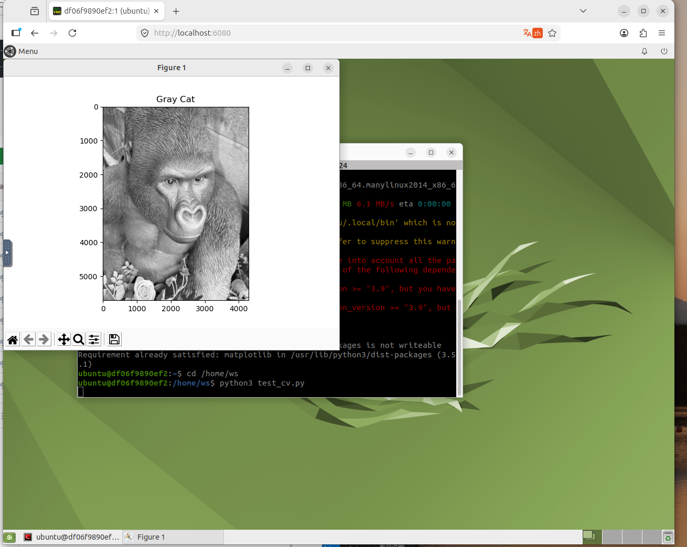

# Week 10 - Docker And OpenCV Experiment

## Task Goal

This week strengthens Docker image workflow and verifies OpenCV-related dependencies for robot vision experiments.

## Folder Check

<pre>
week10/
|-- README.md          # required report
|-- img/               # output image
</pre>

## Environment

- Docker
- Python
- OpenCV
- PyBullet

## Steps

1. Enter the ROS2 container environment.
2. Install OpenCV and PyBullet.
3. Verify that the environment works.
4. Save the configured container as an image.

## Commands

<pre><code>docker commit -m "install pybullet and opencv" d8e79722b2b0 my-ros2-full:v1.0
docker images
docker ps</code></pre>

## Result

## Summary

The task prepares a reusable vision environment. OpenCV and PyBullet support later perception and simulation work.

---

n## 遇到的问题与解决

| 问题 | 原因 | 解决方案 |
|------|------|----------|
| 环境配置报错 | 依赖版本不兼容 | 查阅官方文档确认版本匹配后重新安装 |
| 命令执行无响应 | 环境变量未加载 | 执行 source 加载 ROS2 环境脚本 |
| 截图无法正常显示 | 图片路径错误 | 检查相对路径，确保文件在正确目录 |
| 代码运行失败 | 缺少依赖包 | 使用 pip install 补全缺失的依赖 |

[Back to main archive](../README.md)
