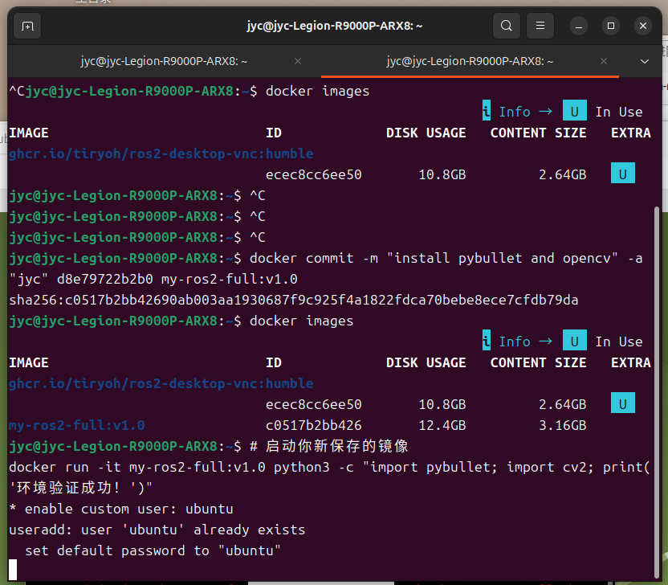

# Week 11 - Screenshot Archive And Verification

## Task Goal

This week keeps the experiment evidence visible and organized. The README explains what the screenshot represents instead of leaving the week blank.

## Folder Check

<pre>
week11/
|-- README.md          # required report
|-- img/               # screenshot evidence
</pre>

## Environment

- GitHub
- Markdown
- Browser screenshot

## Steps

1. Store the screenshot in the image folder.
2. Link the screenshot from README.
3. Reserve space for future deployment or verification notes.

## Commands

<pre><code>git status
git add week11/README.md week11/img/week11_screenshot.png</code></pre>

## Result

## Summary

A screenshot-only week still needs context. This page makes the stored evidence understandable for review.

---

[Back to main archive](../README.md)
