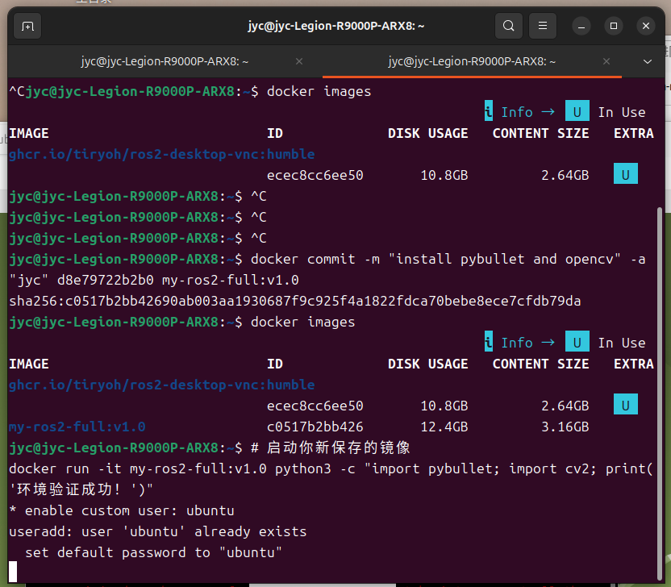

# Week 11 - Screenshot Archive And Verification

## Task Goal

This week keeps the experiment evidence visible and organized. The README explains what the screenshot represents instead of leaving the week blank.

## Folder Check

<pre>
week11/
|-- README.md          # required report
|-- img/               # screenshot evidence
</pre>

## Environment

- GitHub
- Markdown
- Browser screenshot

## Steps

1. Store the screenshot in the image folder.
2. Link the screenshot from README.
3. Reserve space for future deployment or verification notes.

## Commands

<pre><code>git status
git add week11/README.md week11/img/week11_screenshot.png</code></pre>

## Result

## Summary

A screenshot-only week still needs context. This page makes the stored evidence understandable for review.

---

n## 遇到的问题与解决

| 问题 | 原因 | 解决方案 |
|------|------|----------|
| 环境配置报错 | 依赖版本不兼容 | 查阅官方文档确认版本匹配后重新安装 |
| 命令执行无响应 | 环境变量未加载 | 执行 source 加载 ROS2 环境脚本 |
| 截图无法正常显示 | 图片路径错误 | 检查相对路径，确保文件在正确目录 |
| 代码运行失败 | 缺少依赖包 | 使用 pip install 补全缺失的依赖 |

[Back to main archive](../README.md)
