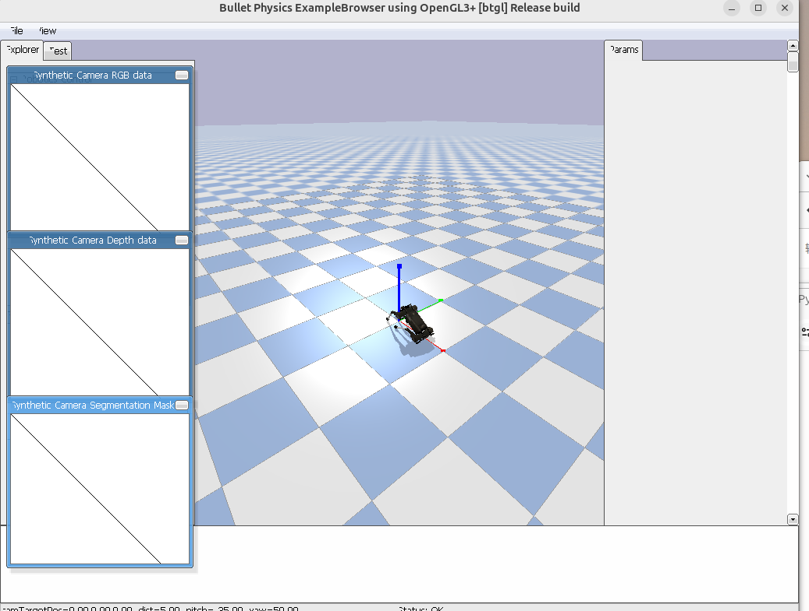

# Week 14：手机遥控 + 迷宫探索小组项目

## 项目目标

本周完成期末小组项目：使用网页控制界面远程控制机器人，并结合迷宫地图与自动探索逻辑，实现“手机遥控 + 迷宫探索”的综合演示。项目方向为 PyBullet 机器狗，同时保留 turtlesim 版本作为对照和备用演示。

## 交付清单

```txt
week14/
|-- README.md
|-- week14_XXXX.pdf       # 项目报告
|-- demo_video.mp4        # 演示视频
|-- index.html            # 手机遥控网页
|-- server.py             # 网络接收与机器人控制服务器
|-- maze.py               # 迷宫地图与碰撞逻辑
|-- explorer.py           # 自动探索与路径规划
|-- agent.py              # AI Agent 控制逻辑
|-- pybullet_perfect.py   # PyBullet 调试脚本
|-- turtlesim_index.html
|-- turtlesim_web_bridge.py
|-- turtlesim_maze.py
|-- turtlesim_explorer.py
|-- docker-compose.yml
|-- img/
```

## 核心功能

### 1. 手机遥控网页

`index.html` 提供浏览器控制界面，包含前进、后退、左转、右转、停止等交互按钮。手机和电脑在同一网络环境下时，可以通过网页向后端控制程序发送指令。

### 2. 网络控制服务器

`server.py` 是常驻控制程序，负责接收网页端控制命令，并把命令转换成机器人运动控制动作。该文件对应评分标准中的“网络接收与机器人控制应写在同一常驻程序中”。

### 3. 迷宫地图

`maze.py` 定义迷宫地图、障碍物和可通行区域，用于验证机器人是否能够在有限空间中完成移动和探索任务。

### 4. 自动探索逻辑

`explorer.py` 实现迷宫探索逻辑，包含路径搜索、目标点选择和自动移动策略。项目中使用该模块展示从遥控到自动探索的扩展能力。

### 5. turtlesim 备用演示

项目同时保留 `turtlesim_web_bridge.py`、`turtlesim_maze.py`、`turtlesim_explorer.py` 和 `turtlesim_index.html`，用于展示 ROS2 turtlesim 方向的网页控制和迷宫探索思路。

## 运行方式

### PyBullet 机器狗方向

```bash
python3 server.py
```

启动后打开：

```txt
http://localhost:8765
```

### turtlesim 备用方向

```bash
python3 turtlesim_web_bridge.py
```

打开：

```txt
http://localhost:8080
```

## 演示视频

<video src="demo_video.mp4" width="800" controls>week14 demo video</video>

[打开演示视频](demo_video.mp4)

## 项目报告

[打开 PDF 项目报告](week14_XXXX.pdf)

## 实验截图




## 系统结构

```txt
手机浏览器
   ↓
index.html 控制按钮
   ↓
server.py 接收指令
   ↓
PyBullet / ROS2 控制逻辑
   ↓
maze.py + explorer.py 迷宫探索
```

## 遇到的问题与解决

| 问题 | 原因 | 解决方案 |
| --- | --- | --- |
| 手机访问本机服务不稳定 | WSL2、端口、防火墙和局域网地址都会影响访问 | 使用固定端口并检查本机 IP、端口转发和防火墙设置 |
| PyBullet 机器狗运动容易不稳定 | 关节方向、初始姿态和控制增益影响仿真 | 先用 `pybullet_perfect.py` 调试稳定姿态，再接入服务器 |
| 迷宫探索需要清晰地图 | 如果障碍物和通行区域不明确，路径规划容易失败 | 在 `maze.py` 中集中维护地图和碰撞规则 |
| 前后端命令需要统一 | 网页按钮和后端动作名称不一致会导致控制失败 | 在 `server.py` 中统一命令映射，如 forward、backward、left、right、stop |

## 学习总结

Week14 项目把前面课程中的网页、Python、机器人控制、迷宫、路径规划和报告整理结合在一起。相比单周实验，期末项目更强调系统完整性：不仅要有代码，还要能通过网页控制、能展示迷宫探索过程、能提供演示视频和 PDF 报告。通过本项目，我理解了机器人项目交付时“代码、文档、截图、视频、报告”都很重要，只有这些材料放在一起，评审者才能完整理解项目效果。

[Back to main archive](../README.md)
