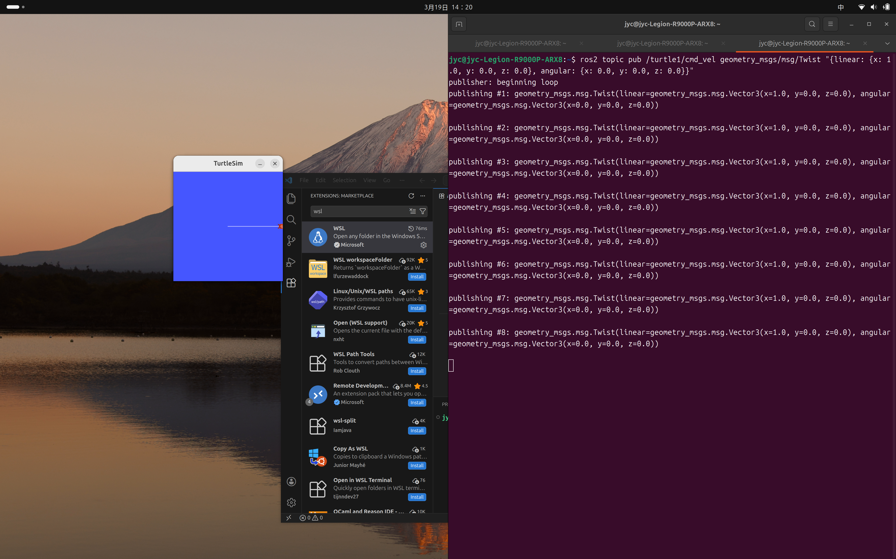

# Week 03 - GitHub SSH, VS Code And ROS2 Interaction

## Task Goal

This week connects development workflow with ROS2 interaction. The task is to use VS Code Remote-WSL and publish ROS2 messages to control turtlesim movement.

## Folder Check

<pre>
week3/
|-- README.md          # required report
|-- code/              # required when code exists
|-- img/               # experiment image
</pre>

## Environment

- VS Code Remote-WSL
- ROS2
- turtlesim
- GitHub SSH

## Steps

1. Open the Linux workspace from VS Code.
2. Start turtlesim.
3. Publish a Twist message to the velocity topic.
4. Save the screenshot as experiment evidence.

## Commands

<pre><code>ros2 topic pub /turtle1/cmd_vel geometry_msgs/msg/Twist "{linear: {x: 2.0}, angular: {z: 1.8}}"</code></pre>

## Result

## Summary

This week shows how topic publishing changes robot behavior. It also confirms that VS Code, WSL, ROS2, and GitHub workflow can be used together.

---

[Back to main archive](../README.md)
