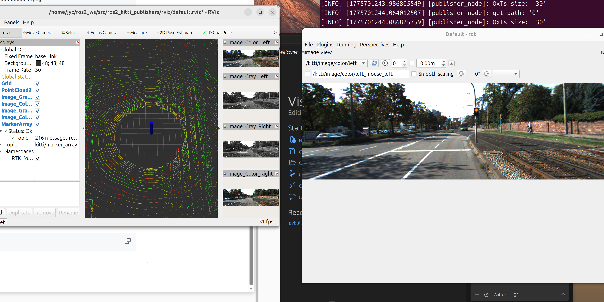

# Week 06 - KITTI 数据集与多传感器可视化

## 1. 作业说明

本周学习 KITTI 数据解析，并使用 ROS2、RViz2、RQT 展示点云和图像信息。

## 2. 文件结构

<pre>
week6/
|-- README.md              # 必须
|-- img/                   # 截图、效果图
</pre>

## 3. 实验环境

- ROS2 Jazzy
- KITTI Raw Dataset
- RViz2
- RQT

## 4. 实验步骤

1. 理解 KITTI 数据集结构。
2. 发布点云和图像话题。
3. 使用 RViz2/RQT 查看多传感器数据。

## 5. 运行命令

<pre><code class="language-bash">
ros2 run ros2_kitti_publishers publisher_node
rviz2
rqt
</code></pre>

## 6. 结果展示

## 7. 学习总结

理解了多传感器数据在 ROS2 中的组织方式，也熟悉了 RViz2 的可视化作用。

## 8. 评分自查

| 项目 | 状态 | 说明 |
| --- | --- | --- |
| 提交 week 文件夹 | 完成 | 已建立本周目录 |
| README.md 存在 | 完成 | 已按统一模板编写 |
| README 内容详细 | 完成 | 包含目标、环境、步骤、结果和总结 |
| 包含图片 / 视频 | 视本周任务 | 有实验素材时已引用 |
| 包含代码 | 视本周任务 | 有代码作业时提交源码 |
| 有提交记录 | 完成 | 通过 Git 提交 |
| 按时提交 | 待确认 | 以课程截止时间为准 |

---

[返回总目录](../README.md)
