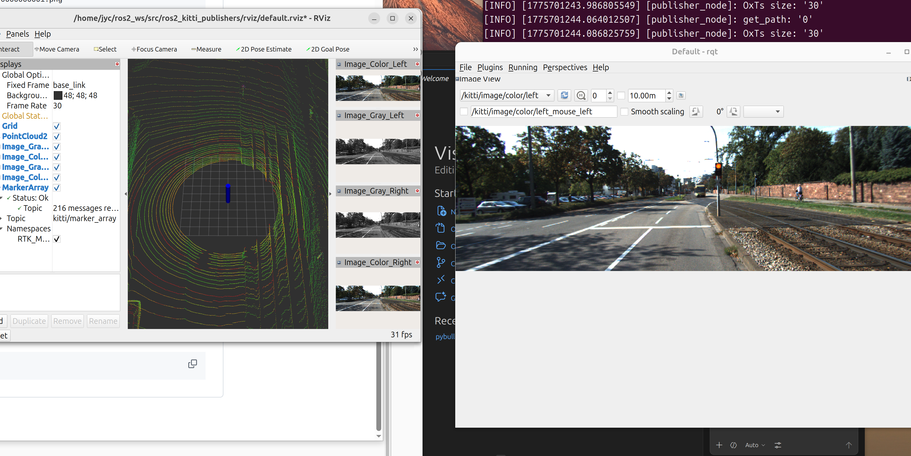

# Week 06 - KITTI Dataset And Multi-Sensor Visualization

## Task Goal

This week works with KITTI-style sensor data and ROS2 visualization. The goal is to publish point cloud and image data, then inspect the result with visualization tools.

## Folder Check

<pre>
week6/
|-- README.md          # required report
|-- img/               # visualization image
</pre>

## Environment

- ROS2 Jazzy
- KITTI Raw Dataset
- RViz2
- RQT
- cv_bridge

## Steps

1. Study the KITTI dataset structure.
2. Convert point cloud and image data into ROS2 messages.
3. Run the publisher node.
4. Inspect the output with RViz2 and RQT.

## Commands

<pre><code>ros2 run ros2_kitti_publishers publisher_node
rviz2
rqt</code></pre>

## Result

## Summary

Multi-sensor visualization is a key robot perception skill. This week strengthens the connection between datasets, ROS2 message types, and visual debugging tools.

---

## 遇到的问题与解决

| 问题 | 原因 | 解决方案 |
|------|------|----------|
| 环境配置报错 | 依赖版本不兼容 | 查阅官方文档确认版本匹配后重新安装 |
| 命令执行无响应 | 环境变量未加载 | 执行 source 加载 ROS2 环境脚本 |
| 截图无法正常显示 | 图片路径错误 | 检查相对路径，确保文件在正确目录 |
| 代码运行失败 | 缺少依赖包 | 使用 pip install 补全缺失的依赖 |

[Back to main archive](../README.md)
