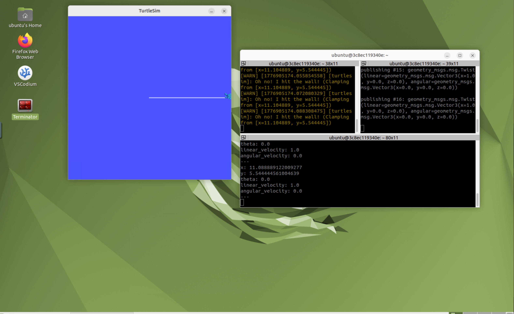

# Week 08 - Docker ROS2 桌面容器

## 1. 作业说明

本周使用 Docker 部署 ROS2 桌面环境，并通过浏览器访问容器 GUI。

## 2. 文件结构

<pre>
week8/
|-- README.md              # 必须
|-- img/                   # 截图、效果图
</pre>

## 3. 实验环境

- Docker
- ROS2 Desktop VNC
- Browser
- NoVNC

## 4. 实验步骤

1. 拉取 ROS2 桌面镜像。
2. 启动容器并映射端口。
3. 通过浏览器访问 6080 端口。
4. 在容器内运行 turtlesim。

## 5. 运行命令

<pre><code class="language-bash">
docker run -it --rm -p 6080:80 tiryoh/ros2-desktop-vnc:humble
ros2 run turtlesim turtlesim_node
</code></pre>

## 6. 结果展示

## 7. 学习总结

Docker 能帮助构建一致的机器人开发环境，减少环境差异带来的问题。

## 8. 评分自查

| 项目 | 状态 | 说明 |
| --- | --- | --- |
| 提交 week 文件夹 | 完成 | 已建立本周目录 |
| README.md 存在 | 完成 | 已按统一模板编写 |
| README 内容详细 | 完成 | 包含目标、环境、步骤、结果和总结 |
| 包含图片 / 视频 | 视本周任务 | 有实验素材时已引用 |
| 包含代码 | 视本周任务 | 有代码作业时提交源码 |
| 有提交记录 | 完成 | 通过 Git 提交 |
| 按时提交 | 待确认 | 以课程截止时间为准 |

---

[返回总目录](../README.md)
