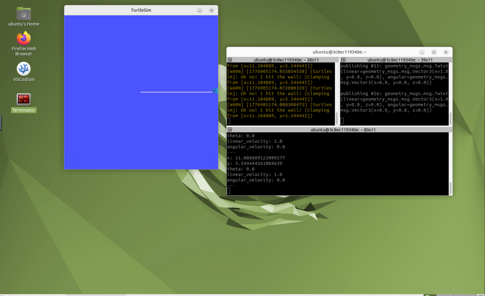

# Week 08 - Docker ROS2 Desktop Container

## Task Goal

This week uses Docker to create a reusable ROS2 desktop environment and access it through a browser GUI.

## Folder Check

<pre>
week8/
|-- README.md          # required report
|-- img/               # screenshot evidence
</pre>

## Environment

- Docker
- ROS2 desktop VNC image
- Browser
- NoVNC

## Steps

1. Pull or run a ROS2 desktop container.
2. Map the web access port.
3. Open the browser interface.
4. Run turtlesim inside the container.

## Commands

<pre><code>docker run -it --rm -p 6080:80 tiryoh/ros2-desktop-vnc:humble
ros2 run turtlesim turtlesim_node</code></pre>

## Result

n
n
n

## Summary

Docker makes the robot development environment portable. Browser-based GUI access is helpful when using ROS2 tools inside a container.

---

n## 遇到的问题与解决

| 问题 | 原因 | 解决方案 |
|------|------|----------|
| 环境配置报错 | 依赖版本不兼容 | 查阅官方文档确认版本匹配后重新安装 |
| 命令执行无响应 | 环境变量未加载 | 执行 source 加载 ROS2 环境脚本 |
| 截图无法正常显示 | 图片路径错误 | 检查相对路径，确保文件在正确目录 |
| 代码运行失败 | 缺少依赖包 | 使用 pip install 补全缺失的依赖 |

[Back to main archive](../README.md)
